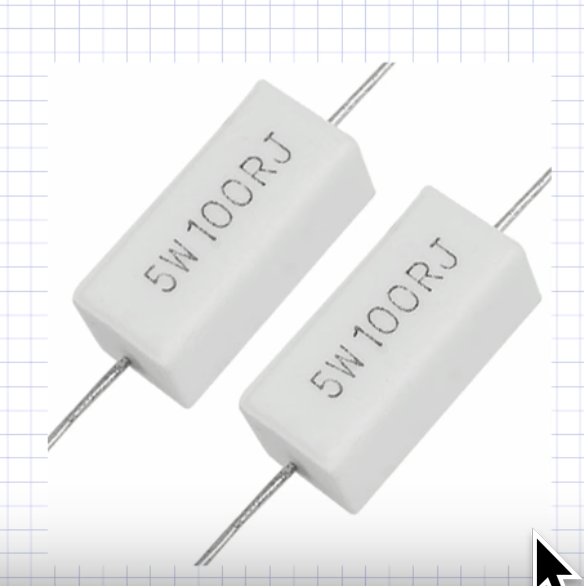
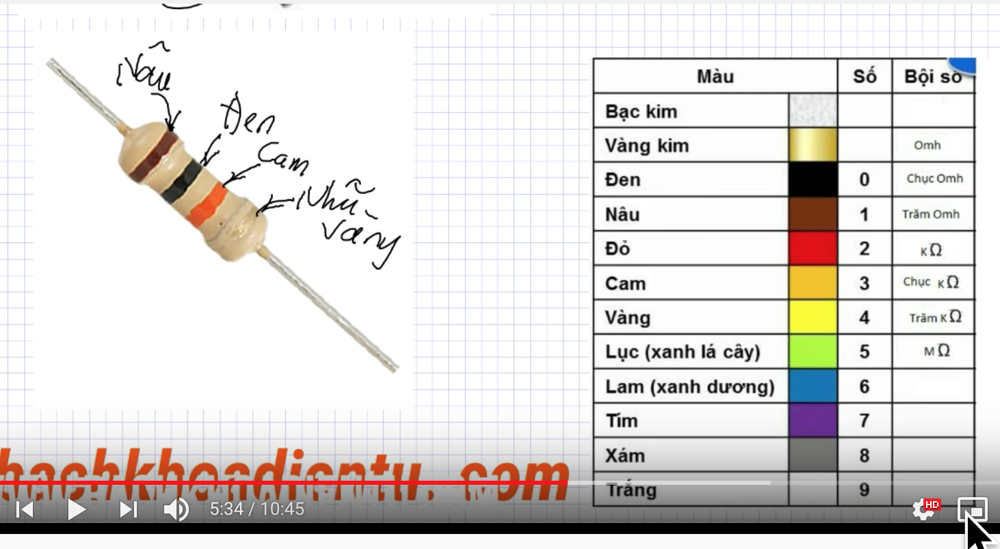

## Định luật Ôm (Ohm's law)
- I = U/R

## Điện trở (Resistance/Resistor)
- Toả nhiệt với công suất: P = U.I = I^2.R = U^2/R (W)
- Mọi linh kiện đều có trở. 
- Ký hiệu là R trên bảng mạch
- Linh kiện có điện trở biến đổi được, gọi là Biến trở (linh kiện này thường có 3 chân)
- Ngoài linh kiện có điện trở cố định ra còn có nhiệt điện trở (điện trở phụ thuộc vào nhiệt độ), Quang điện trở (phụ thuộc ánh sáng)...

## Công dụng của Điện trở
- Toả nhiệt (sợi đốt...)
- Hạn dòng cho các linh kiện điện tử:
  - Mắc linh kiện cần bảo vệ với 1 điện trở phù hợp nhằm tránh quá tải dòng trên linh kiện đó, giúp linh kiện hoạt động tốt.
  - Ví dụ mắc bóng LED nối tiếp với 1 con trở R vào 1 bộ nguồn lớn, giúp bóng sáng mà ko bị cháy. (Thông số cụ thể cần tính toán dựa trên bộ nguồn và các linh kiện tham gia mạch đó)
- Mắc nối tiếp: 
  - U = U1 + U2 + ... + Un
  - R = R1 + R2 + ... + Rn: vậy mỗi con R sẽ gây ra 1 sụt áp trên nó => ứng dụng để chiết áp (chiết áp = chiết xuất (1 phần) điện áp)
    - bản chất mỗi lần vặn chiết áp, là chia ra 2 con R1 và R2, để điều chỉnh điện ráp rơi trên con R1 (hoặc R2) là điện áp đầu ra mong muốn.
  - I = I1 = I2 = ... = In
- Bảo vệ quá dòng cho mạch hoặc linh kiện: 
  - Mắc nối tiếp trở R vào mạch cần bảo vệ. Trở thường có giá trị nhỏ(vài chục ôm trở xuống, thường dùng trong nguồn sung), nhằm tránh sụt áp lớn trên nó.
  - Khi dòng qua R quá tải, R sẽ cháy, và mạch sẽ đc bảo vệ (tương tự cầu chì)
- Làm cảm biến dòng điện
  - Ứng dụng trong các đồng hồ vạn năng, hay các thiết bị đo kỹ thuật điện
  - Dùng một con Rsun có điện trở nhỏ, chỉ 0.x ôm.
  - Mắc Rsun nối tiếp với tải, sẽ đo được dòng đi qua tải.

## Cách đọc giá trị điện trở R trong thực tế
### Giá trị điện trở đc ghi ngay trên thân điện trở
- Thường áp dụng cho điện trở có kích thước lớn, thường là điện trở công suất
- Ví dụ: 
  - 5W = công suất của điện trở
  - 100R = giá trị điện trở là 100 ôm
  - J = sai số là 5%

### Đánh giá trị bằng số
- Áp dụng cho linh kiện có kích thước nhỏ (thường là linh kiện dán)
- Ví dụ: R100, 5R60, 103, 151...
  - Những trở có chữ R thì coi nó như dấu phẩy sau phần thập phân
    - R100 = 0.1 ôm
    - 5R60 = 5.6 ôm
  - Những trở ko có chữ R thì giữ nguyên tất cả chữ số bên trái, và chữ số ngoài cùng bên phải chính là số chữ số 0 thêm vào chữ số bên trái đó. (10^x)
    - 103 = 10 x 10^3 = 10.000 ôm
    - 151 = 15 x 10^1 = 150 ôm

### Đánh giá trị bằng vòng màu
- Áp dụng cho trở có hình dạng tròn
- Đọc theo chiều ngược lại của màu nhũ vàng (vàng kim) hoặc nhũ bạc (bạc kim)
- Nhũ bạc thể hiện cho sai số 10%, và 5% là cho nhũ vàng
- Ví dụ 
  - Điện trở trong hình: Nâu-đen-cam-nhũ vàng, vậy chiều đọc sẽ là từ nâu sang nhũ vàng
  - nâu = 1, đen = 0, cam = 3, nhũ vàng 5%, vậy trở có giá trị: 10 x 10^3 = 10k Ôm, với sai số 5%
- Thực tế thì các trở (và tụ) khi được sản xuất ra sẽ không có giá trị bất kỳ tuỳ ý, mà sẽ có một bảng giá trị cơ sở, và các cấp số của đơn vị này
  - Bảng điện trở cơ sở 
  - Để thu được giá trị điện trở mong muốn mà nằm ngoài bảng giá trị điện trở cơ sở trên, người ta sẽ mắc song song hoặc nối tiếp các tụ với nhau.
  - Ngoài ra người ta cũng sản xuất các trở có giá trị bằng 1/x giá trị cơ sở ở trên. Ví dụ sẽ có các con trở có giá trị là 0.12ôm (=1/10 của 1.2ôm) 
  - Chính vì thế khi đi mua trở hoặc tụ không nên hỏi những giá trị mà không nằm trong bảng cơ sở, sẽ bị đánh giá là không biết gì về điện :))
  - Cũng có ích khi mà đọc giá trị của 1 con trở bằng vạch màu mà đọc ra giá trị không nằm trong bảng cơ sở, lúc ấy thử đọc ngược vạch màu lại xem sao.
 
## Điện trở dành cho người thiết kế
### Bài toán
- Cho 1 nguồn 220v, và một bóng đèn 12v, 10ôm. Tính giá trị điện trở R cần dùng khi mắc nối tiếp với bòng đèn để bóng sáng đúng công suất
  - Dòng qua bóng; 12/10 = 1.2A
  - Do mắc nối tiếp nên điện thế rơi trên R: 220 - 12 = 208
  - Suy ra R = 208 / 1.2 = 173.3
  - Do 173 là giá trị điện trở ko có trong thực tế, nên ta chọn R = 180
- Thực tế: Mắc R = 180 ôm vào mạch trên, hiện tượng xảy ra là bóng ko sáng, mà R lại cháy bụp 1 phát. Hồi lớp 7 cô dạy là mắc đc cơ mà?
- Nguyên nhân: mỗi linh kiện chịu đc 1 dòng nhất định. Vượt quá dòng đó linh kiện sẽ bị hỏng.
  - như trên, con trở phải chịu đc 1 công suất là: P = U.I = 208 x 1.2 = 250W, nhưng do ko chịu đc công suất này nên nó đã bị hỏng. (con trở đã dùng chỉ có P = 0.25W mà thôi)
- Vậy, dòng tối đa của trở chịu được: I = sqrt(P/R), với P và R đều được ghi sẵn khi chế tạo trở.

