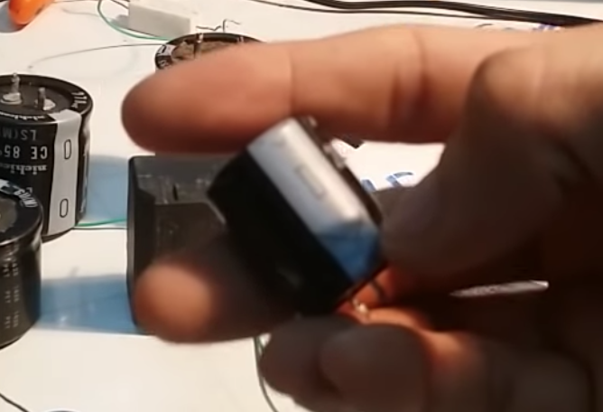
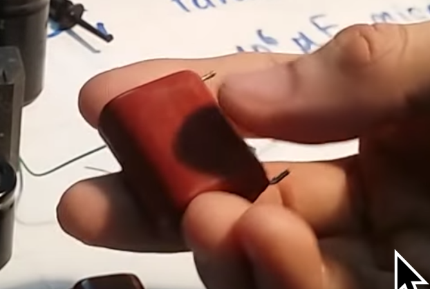

## Tụ điện (Capacitor)
- Ký hiệu trên bảng mạch(bo mạch) là C
- Có khả năng tích trữ điện năng vào bản thân tụ
- Trên tụ ghi giá trị điện dung, và gía trị hiệu điện thế tối đa mà tụ có thể chịu được
  - Đơn vị của điện dung là F (Fara), cho biết lượng điện mà tụ có thể chứa được
  - Nếu vượt quá giá trị hiệu điện thế tối đa thì tụ sẽ bị thủng (hỏng)
- Những tụ có điện dung cỡ F thì là những tụ cực lớn, gọi là siêu tụ. Hầu hết trong thực tế, trên bảng mạch chỉ dùng tụ đến micro F (10^-6 F), nano F(10^-9 F) hoặc pico F (10^-12 F)
- Tụ chia làm 2 loaị: Tụ phân cực là không phân cực
  - Tụ phân cực là tụ phải cấp đúng cực âm dương của nguồn điện vào đúng 2 cực của tụ. Thường dùng trong nguồn điện 1 chiều.
  - Tụ phân cực đa số là tụ hoá, có thể dễ dàng phân biệt bằng vạch trên thân tụ. Cực âm là vạch màu trắng. 
  - Tụ ko phân cực thì ko cần, cấp vào cực nào cũng được. Thường dùng trong nguồn xoay chiều.
  - Tụ ko phân cực thường là tụ phim, tụ màng polyeste. 2 cực như nhau. 
- **Tụ không cho phép dòng một chiều đi qua nó**
  - Nghĩa là, nếu trên bảng mạch có xuất hiện tụ, thì khu vực đó dùng nguồn xoay chiều để nuôi (có dòng xoay chiều hoạt động)
- Khi nap điện vào tụ (mắc nối tiếp tụ và trở R vào nguồn điện) thì tụ không đầy ngay, mà sau một thời gian tụ sẽ đầy, và có điện áp bằng điện áp đầu vào
  - Công thức tính điện áp của tụ ở thời điểm t, với tụ dung lượng C và nguồn đầu vào U0: Uc = U0 x (1- e^(-t/T))
    - T (đọc là Tô): là hằng số bằng tích của trở R được mắc nối tiếp với tụ C đã cho và điện dung C.
      - T = R x C, đơn vị là giây. R đơn vị là ôm, C đơn vị là F.
  - Ví dụ, với: U0 = 220V, tụ C = 1000uF, trở R = 1kOhm, thì thời gian để tụ nạp đầy (có điện áp bằng điện áp đỉnh của nguồn):
    - 220 = 220 x (1-e^(-t/(1000 x 10^-6 x 1 x 10^3))) => t = 5s (nghe sai sai vì phương trình 1 = 1-e^(-t/1) là vô nghiệm, đang hỏi lại tác giả)
- Tương tự, khi xả tụ (mắc song song tụ và trở R vào nguồn) thì sau thời gian t tụ mới xả hết.
  - công thức: Uc = U0 x e^(-t/T)
 
## Dung kháng của tụ
- Khi mắc vào mạch xoay chiều, thì tụ C sẽ có dung kháng Zc, có tác dụng như một trở R
- Dung kháng của tụ **phụ thuộc vào bản thân điện dung của tụ, và tần số điện lưới**
- Zc = 1/(omegaC), với C là điện dung của tụ, và omega w là hằng số, được quy định theo tần số điện lưới mà tụ được mắc vào.
  - w = 2Pi x f, với f là tần số nguồn điện
  - Ví dụ với C = 1.5uF, được mắc vào điện 50Hz, thì Zc = 1/(2Pi x 50 x 1.5 x 10^-6) = 2122(Ohm)

## Ứng dụng của tụ điện
- Ngăn cản dòng 1 chiều đi qua tụ điện (do tụ ko cho dòng 1 chiều đi qua)
- Hạn dòng cho tải bằng cách mắc nối tiếp với tải (do dung kháng của tụ)
  - Muốn tăng dòng qua tải thì mắc song song các tụ với nhau, ngược lại thì mắc nối tiếp.
  - Ưu điểm so với dùng trở để hạn dòng là tụ không gây toả nhiệt và lãng phí điện năng như trở.
- Do khi nạp và xả thì tụ cần một thời gian t mới nạp đầy/xả hết, nên được ứng dụng trong bộ tạo trễ (timer), mạch dao động.

## Cách đọc giá trị tụ trong thực tế
- Tụ hoá (tụ phân cực) thường sẽ ghi giá trị ngay trên thân tụ
- Với tụ phim hay tụ polyeste (tụ không phân cực): giá trị sẽ được đánh số. Cách đọc tương tự đọc giá trị điện trở. Đơn vị của tụ luôn là pF.
  - ví dụ trên thân tụ ghi: 155J vả 400V, thì:
    - Dung lượng tụ: 15 x 10^5 pF = 1.5 uF (micro F), với sai số J = 5%.
    - Điện áp tối đa mà tụ chịu được là 400V
- Để đo dung lượng tụ, người ta dùng đồng hồ vạn năng có chức năng đo tụ, (mode đo tụ là mode có biểu tượng tụ C hoặc biểu tượng -||-)
  - Đồng hồ vạn năng kim ko kiểm tra được điện dung của tụ.
  - **Luôn luôn phải xả tụ trước khi đo**, và hãy cẩn thận khi xả vì điện ra rất lớn, dễ gây giật.